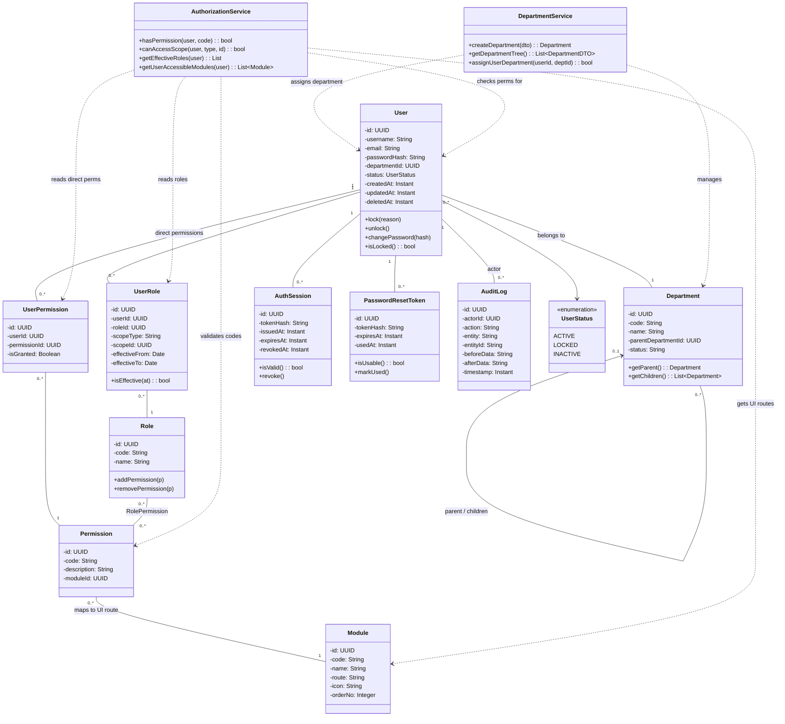

# CLASS DIAGRAM - IDENTITY & ACCESS MANAGEMENT 

Sơ đồ Lớp hệ thống Quản lý Người dùng, Phòng ban và Phân quyền 

```mermaid
classDiagram
    %% ==========================================
    %% 1. ENTITIES LAYER (DOMAINS / DATABASE)
    %% ==========================================
    class User {
        -id: UUID
        -username: String
        -email: String
        -passwordHash: String
        -departmentId: UUID
        -status: UserStatus
        -createdAt: Instant
        -updatedAt: Instant
        -deletedAt: Instant
        +lock(reason)
        +unlock()
        +changePassword(hash)
        +isLocked(): bool
    }

    class Department {
        -id: UUID
        -code: String
        -name: String
        -parentDepartmentId: UUID
        -status: String
        +getParent(): Department
        +getChildren(): List~Department~
    }

    class UserRole {
        -id: UUID
        -userId: UUID
        -roleId: UUID
        -scopeType: String
        -scopeId: UUID
        -effectiveFrom: Date
        -effectiveTo: Date
        +isEffective(at): bool
    }

    class Role {
        -id: UUID
        -code: String
        -name: String
        +addPermission(p)
        +removePermission(p)
    }

    class UserPermission {
        -id: UUID
        -userId: UUID
        -permissionId: UUID
        -isGranted: Boolean
    }

    class Permission {
        -id: UUID
        -code: String
        -description: String
        -moduleId: UUID
    }

    class Module {
        -id: UUID
        -code: String
        -name: String
        -route: String
        -icon: String
        -orderNo: Integer
    }

    class AuthSession {
        -id: UUID
        -tokenHash: String
        -issuedAt: Instant
        -expiresAt: Instant
        -revokedAt: Instant
        +isValid(): bool
        +revoke()
    }

    class PasswordResetToken {
        -id: UUID
        -tokenHash: String
        -expiresAt: Instant
        -usedAt: Instant
        +isUsable(): bool
        +markUsed()
    }

    class AuditLog {
        -id: UUID
        -actorId: UUID
        -action: String
        -entity: String
        -entityId: String
        -beforeData: String
        -afterData: String
        -timestamp: Instant
    }

    class UserStatus {
        <<enumeration>>
        ACTIVE
        LOCKED
        INACTIVE
    }

    %% ==========================================
    %% 2. SERVICE LAYER (BUSINESS LOGIC)
    %% ==========================================
    class DepartmentService {
        +createDepartment(dto): Department
        +getDepartmentTree(): List~DepartmentDTO~
        +assignUserDepartment(userId, deptId): bool
    }

    class AuthorizationService {
        +hasPermission(user, code): bool
        +canAccessScope(user, type, id): bool
        +getEffectiveRoles(user): List
        +getUserAccessibleModules(user): List~Module~
    }

    %% ==========================================
    %% 3. ENTITY RELATIONSHIPS
    %% ==========================================
    Department "0..1" <-- "0..*" Department : parent / children
    User "0..*" -- "1" Department : belongs to
    
    User "1" -- "0..*" UserRole
    UserRole "0..*" -- "1" Role
    
    User "1" -- "0..*" UserPermission : direct permissions
    UserPermission "0..*" -- "1" Permission
    
    Role "0..*" -- "0..*" Permission : RolePermission
    Permission "0..*" -- "1" Module : maps to UI route
    
    User "1" -- "0..*" AuthSession
    User "1" -- "0..*" PasswordResetToken
    User "1" -- "0..*" AuditLog : actor
    User --> UserStatus

    %% ==========================================
    %% 4. SERVICE DEPENDENCY RELATIONSHIPS
    %% ==========================================
    DepartmentService ..> Department : manages
    DepartmentService ..> User : assigns department
    
    AuthorizationService ..> User : checks perms for
    AuthorizationService ..> UserRole : reads roles
    AuthorizationService ..> UserPermission : reads direct perms
    AuthorizationService ..> Permission : validates codes
    AuthorizationService ..> Module : gets UI routes
```